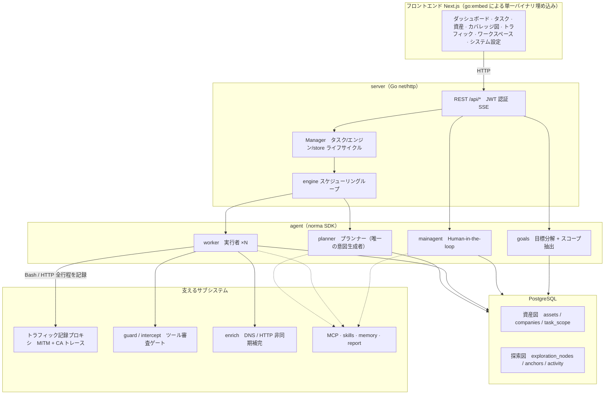
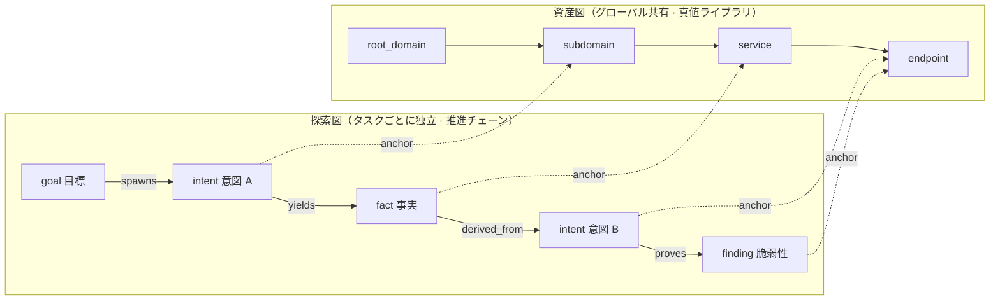
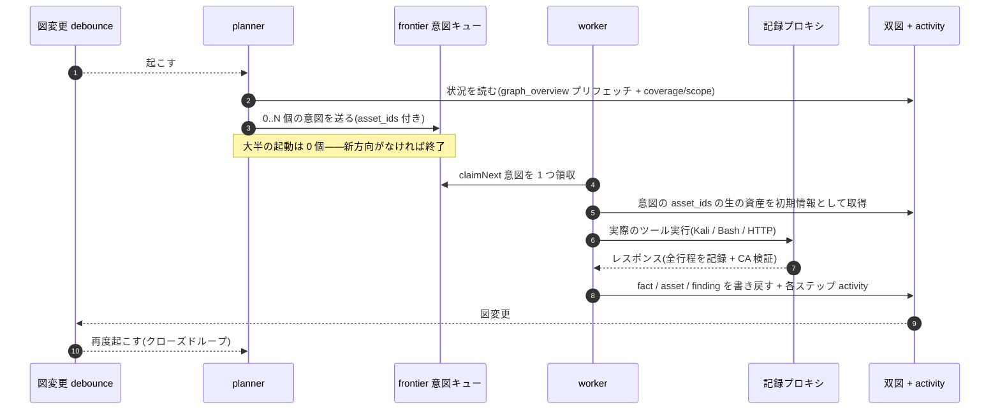
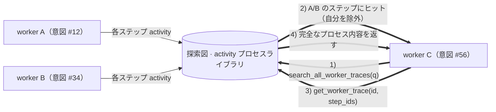
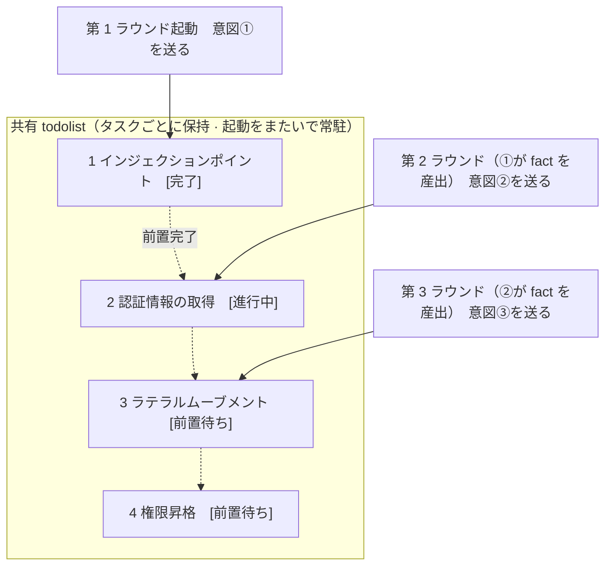

<div align="center">

# ARTEX

AI 自律型ペネトレーションテストシステム（Go バックエンド + Next.js フロントエンド）


🌐 **オンラインデモ**： [https://artex-demo.vercel.app/](https://artex-demo.vercel.app/)

</div>

---

## スクリーンショットプレビュー

> 完全なインタラクションは[オンラインデモ](https://artex-demo.vercel.app/)をご覧ください。

| ダッシュボード（概要 / Token 消費 / アクティビティストリーム） | タスク一覧 |
| :---: | :---: |
|  |  |

| タスク・実行プロセス（セッション / ツール呼び出し） | 探索リンケージ |
| :---: | :---: |
|  |  |

| 発見（Findings） | 資産（Assets） |
| :---: | :---: |
|  |  |

| 資産カバレッジ図（力学的レイアウト・テスト済みハイライト・ノードの折りたたみ展開） |
| :---: |
|  |

| トラフィックレコーディング | Human-in-the-loop 対話 |
| :---: | :---: |
|  |  |

| Agent 管理 | LLM 設定 |
| :---: | :---: |
|  |  |

| インターセプト審査 | バックエンドログ |
| :---: | :---: |
|  |  |


---

## 審査記録の詳細

グローバルの「審査記録」、タスク内の「インターセプト審査」、および対話内の審査カードは、いずれも展開して詳細を確認できます。表示構造は
[AegisHook の審査詳細コンポーネント](https://github.com/RuoJi6/AegisHook/blob/main/web/src/components/CallDetail.vue)を参考にしており、ARTEX のコンポーネントとテーマを踏襲しています：


## 資産同期（ScopeSentry）

[ScopeSentry](https://github.com/Autumn-27/ScopeSentry) から資産データを直接同期でき、重複した収集作業を省けます：

- 「**資産同期**」ページで ScopeSentry のアドレスと API Key を入力し、データソースに接続します；
- **プロジェクト**または**タスク**の単位で、同期する対象と資産タイプ（ドメイン / サブドメイン / IP / ポート / サイト / エンドポイント…）を選択します；
- ワンクリックでインポートし、企業の資産スコープに従ってマージすると、そのまま ARTEX の資産図に入り、agent の探索に利用できます。

---

## インストール

> データベースとして **PostgreSQL** が必要です；探索には **LLM** の設定が必要です（`ANTHROPIC_API_KEY` または `OPENAI_API_KEY`、UI 上でも設定可能）。

### 方法一：ワンクリックインストールスクリプト（推奨）

```bash
git clone https://github.com/Hinln/ARTEX.git
cd ARTEX
./install.sh
```

スクリプトの動作：Docker を検出 / 自動インストール → **① すべて Docker** または **② ローカルコンパイル実行** を選択：

- **① すべて Docker**：Postgres のパスワードを一つ入力（Enter でランダム生成も可）→ 自動で `.env` を書き込み → `docker compose up -d`。
- **② ローカル実行**：データベースを選択（既存に接続 / Docker で起動）→ `config.json` を生成 → `go` でフロントエンドを埋め込んだ単一バイナリをコンパイル → 起動。

インストール後、**http://localhost:8787** を開きます（初回アクセス時は `/setup` で管理者パスワードを設定）。

### 方法二：Docker Compose（手動）

```bash
git clone https://github.com/Hinln/ARTEX.git
cd ARTEX
cp .env.example .env          # POSTGRES_PASSWORD を記入、ANTHROPIC_API_KEY は任意
docker compose up -d          # autumn27/artex イメージ + postgres を取得
# → http://localhost:8787
```

イメージには常用ツール（ripgrep/curl/vim/npm/nmap…）が含まれています；`./skills` と `./data` はバインドマウントで永続化されます。

リモート MCP は、システム設定で `http`（Streamable HTTP）または `sse`（旧版 SSE）を選択できます。
旧版 SSE サービスは通常 `GET /sse` でイベントストリームを確立し、サービスが返す
`/message?sessionId=...` を介して JSON-RPC リクエストを受信します；設定時は URL に `/sse` を入力し、リクエストヘッダは
`Authorization=Bearer <token>` の形式で入力します。

### 方法三：プリコンパイル済みバイナリのダウンロード（Releases）

[Releases](https://github.com/Hinln/ARTEX/releases) から対象プラットフォームの zip をダウンロードし、解凍すると `artex` + `start.sh`（Windows は `start.bat`）+ `skills/` + `config.example.json` が得られます：

```bash
cp config.example.json config.json   # database 接続情報を記入
./start.sh                           # → http://localhost:8787
```

> `./artex` を直接実行するのではなく、`start.sh` / `start.bat` で起動してください。これは監視スクリプトです：プログラム終了後、終了コードに応じて再起動するかどうかを判断し、**ページ上の[ワンクリック更新](#方法一ページでのワンクリック更新推奨)はこれによって入れ替えを完了します**。`./artex` を直接実行すると、更新後に再起動されません。
> バックグラウンド常駐：`nohup ./start.sh >artex.log 2>&1 &`。

### 方法四：ソースコードから単一バイナリをコンパイル

```bash
# 1) フロントエンドを静的エクスポート
cd web && npm ci && npm run build:static && cd ..
# 2) 埋め込みディレクトリにコピー
cp -r web/out server/webui/dist
# 3) コンパイル（-tags embedui を付けるとフロントエンドを埋め込む）
CGO_ENABLED=0 go build -tags embedui -o artex ./cmd/artex
./start.sh
```

### 方法五：クロスプラットフォーム Release 圧縮パッケージのビルド

`build.sh` はまずフロントエンドをビルドして埋め込み、次に Go linker でデバッグ情報を除去し、リリースファイルを zip に圧縮します。Release モードではデフォルトで Linux amd64/arm64、macOS amd64/arm64、Windows amd64 の zip パッケージを生成します：

```bash
./build.sh --release
# 成果物：dist/artex-0.3.3-*.zip
```

UPX の自己解凍バイナリは一部の Linux カーネル、仮想化環境、またはセキュリティポリシーと互換性がない場合があるため、デフォルトでは有効になっていません。`ARTEX_TARGETS` でターゲットをカスタマイズできます；ターゲットの実行環境が互換であると確認できた場合は、`--upx` を明示的に渡すことでバイナリをさらに小さくできます：

```bash
ARTEX_TARGETS=linux/amd64,windows/amd64 ./build.sh --release
./build.sh --target linux/amd64 --upx
```

---

## アップデート・アップグレード

> アップグレードはプログラムの入れ替えのみで、データには手を付けません：Postgres のデータボリューム `pgdata`、`./data`（jwt.key / SQLite など）、`./skills` はいずれも保持されます。**データベースのマイグレーションを手動で実行する必要はありません**——`artex` は起動のたびに `schema.sql`（`ADD COLUMN` / `CREATE INDEX IF NOT EXISTS` を含む）を冪等に再実行します。つまり「再起動すればマイグレーション」です。アップグレード前には `./data` とデータベースのバックアップを取ることを引き続き推奨します。

### 本リポジトリのプライベート Release 更新ソース

ページのワンクリック更新は、常に [Hinln/ARTEX Releases](https://github.com/Hinln/ARTEX/releases) からバージョンをチェック・ダウンロードします。クローンや Git によるソースコードの更新も `Hinln/ARTEX` を使用します；元プロジェクトの Go module パスは変更されていません。

これはプライベートリポジトリです。ARTEX を実行するバックエンドプロセスに `ARTEX_UPDATE_GITHUB_TOKEN` を設定してください。トークンには本リポジトリの **Contents: read** 権限のみが必要です。トークンはバックエンドが Release のクエリと添付ファイルのダウンロードに使用するもので、ブラウザには送信されません。また Git にコミットしないでください。

```bash
# まず現在の shell またはサービス環境で ARTEX_UPDATE_GITHUB_TOKEN を安全に設定
./start.sh
```

ローカルで直接起動する場合、`start.sh` は `.env` を自動的に読み込みません；変数をプロセス環境にエクスポートする必要があります。Docker Compose でのデプロイでは、Git に含まれない `.env` にこの変数を記入し、artex コンテナを再ビルドできます；イメージには本ブランチの更新コードが含まれている必要があり、旧版イメージでは更新ソースが切り替わりません。

ページでインストール可能な更新を提供するには、まず本リポジトリで draft でも prerelease でもない正式な Release を公開し、`artex-<バージョン>-<os>-<arch>.zip` と `SHA256SUMS` を添付する必要があります。リポジトリにソースコードしかない状態では、オンラインアップグレードはまだできません。既存の Release ワークフローは、`v*` タグをプッシュした際に現在のリポジトリ向けにこれらの添付ファイルを生成します。

### 方法一：ページでのワンクリック更新（推奨）

**システム設定**ページ（サイドバーの「システム設定」→ `/system/settings`）の**バージョンと更新**カードで、サーバーにログインすることなく新しいバージョンを直接チェック・インストールできます。

「更新」をクリックすると：現在のプラットフォームのリリースパッケージをダウンロード → Release の `SHA256SUMS` と照合 → `-h` で新バイナリをスモークテスト → `artex.new` として一時保存 → プログラムが終了し、`start.sh` / `start.bat` によって再起動され入れ替えが完了します。ページは新バージョンが起動するまで自動的に待機してリフレッシュします。

- **失敗しても壊れたプログラムは残りません**：検証やスモークテストに通らなければ一時ファイルを破棄し、現行バージョンの実行を継続します；入れ替え後の新版が連続 3 回起動に失敗した場合、自動的に `artex.old` にロールバックします（失敗したものは調査用に `artex.failed` として残します）。
- **いつでもロールバック可能**：直前のバージョンは `artex.old` として保持され、カード上に「前のバージョンにロールバック」があります。データベースの構造はロールバックされない点に注意してください。
- **更新は実行中のタスクを中断します**——更新は即ち再起動なので、アイドル時に実行してください。
- **開発ビルドでは更新できません**：バージョン番号が `dev` または `git describe` にサフィックスが付いている場合は無効化され、正式版がローカルでデバッグ中のバイナリを上書きするのを防ぎます。
- **Docker 下ではプログラムのみ入れ替え、イメージは入れ替えません**：イメージ内の playwright / nmap などのツールチェーンは一緒にアップグレードされず、`docker compose up -d` でコンテナを再ビルドするとイメージ付属のバージョンに戻ります。イメージごとアップグレードするには `docker compose pull artex && docker compose up -d artex` を使用してください。
- GitHub へのアクセスにプロキシが必要な場合は、同じページで**グローバルプロキシ**を設定すれば、更新経路もそれを経由します。更新は GitHub ドメインからのみダウンロードし、HTTPS を強制します。

### 方法二：ワンクリック更新スクリプト

```bash
cd ARTEX
./update.sh
```

スクリプトはまずオプションで `git pull` により最新コードを取得し、次に **① Docker 更新** または **② ローカルコンパイル更新**（`install.sh` に対応）を選択させます：

- **① Docker**：対象イメージの tag を指定可能（Enter で `.env` の `ARTEX_TAG` を踏襲、デフォルトは `latest`）→ `docker compose pull` → `docker compose up -d`（新イメージに入れ替えて再起動すれば自動マイグレーション）。
- **② ローカル**：フロントエンドの静的成果物を再ビルド → `./artex` を再コンパイル（完了後、プロセスを再起動して反映）。

### 方法三：Docker Compose（手動）

```bash
cd ARTEX
git pull                       # compose / スクリプトを更新（任意）
# バージョン指定：.env に ARTEX_TAG=v0.2.0 を設定；未設定なら latest を使用
docker compose pull artex
docker compose up -d artex     # 新イメージに入れ替えて再起動 → schema を自動マイグレーション
docker image prune -f          # 旧イメージを整理（任意）
```

### 方法四：プリコンパイル済みバイナリ（Releases）

[Releases](https://github.com/Hinln/ARTEX/releases) から新バージョンの zip をダウンロードし、旧プロセスを停止してから `artex` と `skills/` を上書きし（あなたの `config.json` と `data/` は保持）、再起動するだけです：

```bash
cp -r <解凍先ディレクトリ>/skills ./ && cp <解凍先ディレクトリ>/artex ./
./start.sh
```

### 方法五：ソースコードからコンパイル

```bash
git pull
cd web && npm ci && npm run build:static && cd ..
cp -r web/out server/webui/dist
CGO_ENABLED=0 go build -tags embedui -o artex ./cmd/artex
# ./start.sh を再起動
```

---

## 設定

**データベース**（`config.json`、または環境変数 `ARTEX_PG_DSN` で上書き）：

```json
{
  "database": {
    "host": "127.0.0.1", "port": 5432,
    "user": "artex", "password": "yourpass",
    "dbname": "artex", "sslmode": "disable"
  }
}
```

**LLM**：`export ANTHROPIC_API_KEY=sk-...`（または `OPENAI_API_KEY`）、UI の「LLM 設定」ページでも入力できます。
オプション：`ARTEX_LLM_PROVIDER` / `ARTEX_LLM_MODEL` / `ARTEX_LLM_BASE_URL` / `ARTEX_LLM_PROXY`。

**並行性**：各タスクの work agent 数は「システム設定」で設定します（デフォルト 3）。

**よく使うパラメータ**：`./start.sh -addr :8787 -proxy :8788`（`-addr` はフロントエンド+API、`-proxy` はトラフィックレコーディングプロキシ）。起動スクリプトはパラメータをそのまま `artex` に透過します。

### リバースプロキシでのデプロイ（HTTPS / 443 のみ開放）

フロントエンドと API/SSE はいずれも同一のバックエンドポート（デフォルト `:8787`）が提供し、リアルタイムのアクティビティストリームはデフォルトで**同一オリジン**のアドレスを経由するため、**`NEXT_PUBLIC_SSE_BASE` を設定する必要はありません**。公開側は 443 のみを開放し、8787 は内部ネットワークに残せます。

SSE は持続的な接続 + 継続的なプッシュであるため、リバースプロキシでは**必ずバッファリングを無効化**する必要があります。さもなければブラウザは接続できてもイベントを受信できません（アクティビティストリームがずっとロード中になる現象として現れます）。Nginx の例：

```nginx
server {
    listen 443 ssl;
    server_name your.domain.com;
    # ssl_certificate / ssl_certificate_key ...

    location / {
        proxy_pass http://127.0.0.1:8787;
        proxy_set_header Host $host;
        proxy_set_header X-Forwarded-Proto $scheme;

        # SSE の重要項目：バッファリング無効化、長いタイムアウト、HTTP/1.1
        proxy_buffering off;
        proxy_cache off;
        proxy_read_timeout 3600s;
        proxy_http_version 1.1;
        proxy_set_header Connection "";
    }
}
```

> SSE をページとは異なるオリジン（独立したサブドメインなど）で経由させる必要がある場合のみ、**ビルド時**に `NEXT_PUBLIC_SSE_BASE` を設定してください（この変数は `next build` 時に静的パッケージへ固定され、コンテナの実行時に設定しても無効です）。

---


## 開発

### 手動の脆弱性再テスト

タスク詳細の「再テスト」タブでは、本タスクの脆弱性をページ単位で選択し、過去の結論と証拠を確認し、手動で再テストを開始できます。開始後は現在のタブを保持し、ローディングアイコンと「再テスト中」を表示します；修復を確認すると脆弱性のステータスを同期的に更新します。

脆弱性一覧の各行の操作エリアで「再テスト」をクリックするか、脆弱性詳細の「脆弱性再テスト」エリアで「再テストを開始」をクリックし、任意の修復バージョン・テスト条件・制約を入力すると、システムは独立した再テスト Agent セッションを作成し、開始後は現在のページを保持します。一覧のフラット表示、タスク別グループ化、資産ビューのいずれもこの入口をサポートします；再テスト実行中はローディングアイコンと「再テスト中」を表示し、確認したい場合はクリックして該当セッションに入り、終了後は「再テスト」に戻ります。再テストに元のスキャンタスクを再起動する必要はなく、結論は「依然として再現可能」「修復済み」「確認不能」に分かれ、各回の結論・証拠・セッションリンクは脆弱性詳細に保存されます。

新版バックエンドは初回起動時に、編集可能な「脆弱性再テスト」（`retester`）Agent をプリセットし、Agent 管理でプロンプト・LLM・実行予算・ツールを設定できます。デフォルトでは紐付けられた LLM を使用し、未紐付けの場合はグローバルで有効化された設定を使用します。再テストセッションが正常に完了し結論が「修復済み」の場合、システムは自動的に脆弱性の対処ステータスを「修復済み」に変更します；実行中・失敗・停止、またはその他の結論の場合は元のステータスを保持します。元の証拠とレポートは常に保持されます。ステータスのドロップダウンメニューから手動で「修復済み」を選択することもできます。同一の脆弱性が再テスト中の場合は既存のセッションを再利用し、停止・失敗、またはサービス再起動後に再度開始できます。

本バージョンの履歴記録は脆弱性詳細とセッションから確認でき、まだ脆弱性レポートのエクスポートやタスクのアーカイブパッケージには含まれず、トラフィックパケットとも自動的に関連付けられません。デモモードでは明示的に表示されるモック記録のみを生成し、実際のターゲットにはリクエストしません。

### ローカル実行とテスト

```bash
./dev.sh    # バックエンド(:8787) + トラフィックプロキシ(:8788) + フロントエンド next dev(:5173) → http://localhost:5173
```

- バックエンド：`go run ./cmd/artex`（`-tags embedui` を付けない場合はフロントエンドを埋め込みません）
- フロントエンド：`cd web && npm run dev`（`/api` はバックエンドにリバースプロキシされ、ホットリロード付き）
- テスト：`go test ./...`
- Mock プレビュー（バックエンドなし）：`cd web && NEXT_PUBLIC_MOCK=1 npm run dev`

---

## システム技術アーキテクチャ

ARTEX は **LLM マルチ agent 駆動の自律型ペネトレーションシステム**です：Go モノリシックバックエンド（Next.js フロントエンドを埋め込み）+ PostgreSQL で、agent 能力は [`norma`](https://github.com/Autumn-27/norma) SDK（`agentcore` / `tool` / `permission` / `harness` / `memory` / `transcript`）が提供します。中核は**デュアルグラフアーキテクチャ**と、それを取り巻く 2 つの自律性メカニズム：**worker 間のプロセスレベルの情報交換**と **planner による複数ラウンドの共有 todolist を用いた安定した攻撃リンケージ**です。

### 全体の階層



| 層 | 責務 |
| --- | --- |
| **フロントエンド** | Next.js の静的エクスポートで、`go:embed` により単一バイナリに埋め込み；タスク/資産/探索リンケージ/カバレッジ図を可視化し、Human-in-the-loop 対話を提供 |
| **server** | `net/http` ルーティング + JWT 認証 + SSE；`Manager` がタスク・エンジン・DB store のライフサイクルをホスト |
| **engine** | タスクごとに 1 つの `plannerLoop` + N 個の worker goroutine；意図の受領、タイムアウト/一時停止/drain |
| **agent** | goals / planner / worker / mainagent、`ToolSet` がデュアルグラフを LLM ツールとして公開 |
| **db** | デュアルグラフの Postgres 永続化（pgx）；schema は `go:embed` により毎回の起動で冪等にテーブル作成 |
| **支撑** | 記録型 MITM プロキシ、審査ゲート、非同期補完、MCP/スキル/メモリ/レポート |

### デュアルグラフアーキテクチャ：探索図 + 資産図

システムは「**ターゲットが何か**」と「**どの程度までテストしたか**」を、相互に独立しつつアンカーで接続される 2 つのグラフに分割します：

- **資産図（Asset Graph、グローバル共有）**：タスクをまたいで同一の、資産の真値ライブラリ。ノードは `root_domain / subdomain / ip / service / app / endpoint` で、企業に帰属します；ドメイン→サブドメイン→サービス→エンドポイントの親子関係と重複排除キーはすべてプログラムが計算し、agent は生の情報を提出するのみです。
- **探索図（Exploration Graph、タスクごとに独立）**：1 回のタスクの「思考と推進」のプロセス。ノードは `goal（目標）/ intent（意図）/ fact（事実）/ finding（脆弱性）/ hint（ヒント）` で、`spawns / derived_from / yields / proves` などのエッジによって**系譜リンケージ**に繋がり、「どの方向がどの事実から派生し、何を生み出したか」に答えます。
- **2 つの図はアンカーで接続されます**：`exploration_anchors(node_id, asset_id)` が意図/事実/脆弱性を具体的な資産にアンカリングします——これにより「探索方向」からそれがどの資産を攻めているかを見ることも、「ある資産」から本タスクでそれがどの意図でテストされ、どの事実が導かれたかを逆引きすることもできます。これは**資産テストカバレッジ**と**資産カバレッジ図**（スコープ内資産 + テスト済みハイライト）も支えています。



> 役割分担：**planner** は探索図の状況を読み、目標を判断し、未カバーの新方向がある場合にのみ**意図**を frontier に送り込みます；**worker** は**意図を 1 つ**領収し、実際のツールで実行し、新しい資産/事実/脆弱性を両図に書き戻してから停止します。資産図は共有された事実であり、探索図はタスクごとの推進リンケージです。

### エンジンと意図のライフサイクル（1 回の探索のクローズドループ）

エンジンは**イベント駆動**のクローズドループです：グラフが変わると planner を起こし、planner が意図を送り、worker が意図を領収して実行し書き戻し、書き戻しがさらに次のラウンドをトリガーします——目標が証明される（`prove_goal`）まで続きます。



### worker 間のプロセスレベルの情報交換

1 回の踏み込んだ探索では、多くの価値ある観察（あるエラー、あるレスポンスの一部、ある隠しパラメータ）が、ある worker の**実行プロセス**の中に現れますが、必ずしも正式な fact として書き込まれるとは限りません。重複作業を避け、リンケージ上の worker が互いの肩の上に立てるようにするため、worker は**work をまたいでプロセスを検索する**能力を備えています：

- `search_all_worker_traces(q)`：**本タスクの他の work の実行プロセス**内でキーワードによって検索します（自分のこの意図のステップは自動的に除外）、ヒット項目には `intent_id` が付きます；
- `list_worker_traces` / `get_worker_trace(intent_id, step_ids=[…])`：まずどの work が走ったかを確認し、次にある work の具体的な数ステップの完全な内容を取得して詳細を交換します。

これにより、探索図上にまだ対応する fact がなくても、後続の worker は他者のプロセスの中の観察を再利用できます——**情報は worker 間を「実行プロセス」の粒度で流れ**、境界は変わりません（各 worker は依然として自分が領収したその 1 つの意図だけを行います）。



### planner の複数ラウンド共有 todolist → 安定した攻撃リンケージ

実際の攻撃リンケージは往々にして**前後の依存関係を持つ複数ステップのシーケンス**（例：インジェクションポイントの発見 → 認証情報の取得 → ラテラルムーブメント → 権限昇格）であり、これらを一度に並行して送り出すと混乱するだけです。そのため planner は**タスク単位で保持され、起動をまたいで共有される計画 todo（todolist）**を 1 つ持ちます：

- planner はイベント駆動です——グラフが変わると起こされますが、**毎回の起動は全く新しいセッション**です；共有される todolist により、1 本の直列の攻撃チェーンを**一度記録**し、その後の複数ラウンドで**依存関係に従って段階的に意図を送る**ことができ、チェーン全体を 1 ラウンドで前倒しに展開することはありません；
- 各ラウンドでは「前置ステップが完了済みで、依存する fact が既に存在する」次のステップにのみ意図を送り、進捗に応じてリストを更新します（fact によって満たされたステップを完了としてマーク）。



こうして攻撃リンケージは「イベント駆動 + ステートレスセッション」の環境下でも**安定して推進し、重複せず、順序を誤りません**——これが ARTEX が自律的に複数ステップの攻撃チェーンを走破できる鍵です。

---

## 交流グループ

QR コードを読み取って WeChat 公式アカウント **SecSentry** をフォローし、公式アカウントの管理画面でダイレクトメッセージを送ればグループに参加して交流できます。

<div align="center">


</div>

---
## 参考

https://github.com/oritera/Cairn


## ライセンスと免責事項

### オープンソースライセンス

本プロジェクトは **GNU Affero General Public License v3.0（AGPL-3.0）** でライセンスされており、完全な条項はリポジトリのルートディレクトリにある [LICENSE](LICENSE) ファイルを参照してください。

これは、誰もが本プロジェクトを自由に使用・修正・配布できることを意味しますが、**派生作品も同様に AGPL-3.0 でオープンソース化しなければなりません**；特に、**本プロジェクトを修正し、ネットワーク経由（オンラインサービスとしてのデプロイなど）でユーザーに提供する場合も、それらのユーザーに対応する完全なソースコードを公開しなければなりません**。

> ⚠️ **重要な注意**：オープンソースライセンス自体はソフトウェアの使用目的を制限しません。以下の「使用制限」と「免責事項」は、作者から使用者への追加の取り決めと厳粛な宣言であり、必ず遵守してください。

**ARTEX は個人の学習、コード研究、ローカルでの技術検証のみに使用でき、いかなるオンラインシステムやウェブサイトに対して実際のテストを行ってはなりません。**

### 許可される使用範囲

- **本プロジェクトのソースコードを読む・学習する・研究する**こと、および**ローカルの隔離環境**で技術原理を検証することのみに使用できます；
- 個人の学習、学術研究、コードレビューなどの非攻撃的な用途に適用されます。

### 禁止事項

- **本ツールを使用して、いかなるウェブサイト、オンラインサービス、またはネットワーク接続されたシステムに対してスキャン・探索・利用・攻撃を行うことを厳禁します**（授権の有無、自己資産であるか否かを問わず）；
- 本ツールを実際のペネトレーションテスト、攻防対抗、または本番環境に使用することを厳禁します；
- 本ツールを不正侵入、データ窃取、恐喝、サービス拒否、またはあらゆる破壊的・犯罪的な活動に使用することを厳禁します；
- 本ツールを使用して、所在する国・地域の法令に違反する行為に従事することを厳禁します。

### コンプライアンス責任

使用者は、所在する国・地域のネットワークセキュリティ、データ保護、コンピュータ犯罪に関するすべての法令（中国本土では「ネットワークセキュリティ法」「データセキュリティ法」「個人情報保護法」および関連する司法解釈を含むがこれらに限らない）を自ら遵守しなければなりません。**本ツールの使用によって生じるすべての法的責任と結果は、使用者が自ら負うものとします。**

### 免責事項

本プロジェクトは「現状のまま（AS IS）」で提供され、明示または黙示を問わずいかなる保証も伴いません。作者および貢献者は、本ツールの使用（使用方法が適切であるか否かを問わず）によって生じたいかなる直接的または間接的な損失、データ損失、システム損傷、または法的紛争についても責任を負いません。**本プロジェクトをダウンロード・インストール・使用することは、あなたが上記のすべての条項を読み、理解し、同意したことを意味します。**
