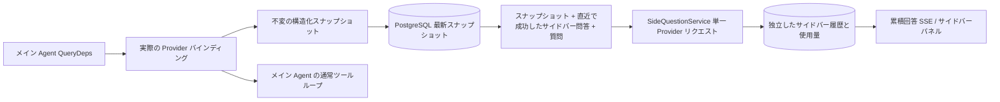

# ARTEX `/btw`

通常のチャット、タスクの MainAgent、および現在のタスク自身の Worker は、それぞれ独立したサイドバー質問（旁路提問）をサポートします。メイン入力欄に `/btw 質問` を入力すれば送信でき、空の `/btw` または「サイドバー質問」ボタンで履歴を開きます。デスクトップでは幅を調整できるサイドバーを、モバイルでは Drawer を使用します。

サイドバー回答は、送信時点の Agent コンテキストのスナップショットに基づいて生成され、ストリーミング表示、追問、停止、クリアに対応します。パネルを閉じる、ページを更新する、SSE が切断されるといった操作では、モデルへのリクエストはキャンセルされません。停止は現在のサイドバーのみに影響します。クリアはサイドバーをキャンセルしてサイドバー履歴を削除しますが、メインコンテキストのスナップショットは保持します。

## 実装の境界

Go、norma v0.3.7、Next.js、既存の Markdown / ResizablePanel / Drawer / AlertDialog コンポーネントをそのまま利用しています。norma のソースコードは変更しておらず、サイドバー用に依存関係を追加してもいません。Planner、他のタスクから継承した Worker、ツール型サブタスクの昇格は今回の範囲外です。

- `capture.go` は `Options.Deps.CallModel / CallModelSync` でのみメインループのリクエストをマークします。Provider デコレータは具体的なモデルの内部、ルーティングプールの外側で選択が行われた後に位置するため、実際に選択されたモデルを記録します。圧縮および要約のリクエストはスナップショットを上書きしません。
- リクエスト開始時、モデルの完全な応答時、実行の終了状態でスナップショットを公開します。生成途中の部分的な応答は公開しません。ツール呼び出しは norma の `MessagesForAPI` を通じてペアを維持し、ツール結果は次のメインモデルリクエストまたは実行の終了状態でスナップショットに入ります。ストリーミングの中断時は直前の有効な境界を保持します。
- スナップショットは JSON のディープコピーを通じて、構造化メッセージ、システムプロンプト、ツール定義、生成パラメータを保持します。モデルの推論はスナップショットのロックやデータベーストランザクションを保持しません。
- `SideQuestionService` は具体的な Provider を呼び出します。必要に応じて先にサイドバー要約を生成し、最終回答は初回でコンテキストが上限を超過し、かつまだテキスト／ツール呼び出しを出力していない場合に限り、縮小した上で 1 回だけリトライを許可します。agent session を作成せず、ツール実行器、メインの transcript、アクティビティストリーム、タスクグラフにも接続せず、タスクのモデル切り替えチェーンも経由しません。回答がツール定義を保持するのは、既存の構造化ツールコンテキストとの互換性のためです。要約リクエストにはツールを提供しません。新たに返されたツール呼び出しには実行経路がありません。
- 親セッションごとに実行中のリクエストは 1 つ、単一のサービスプロセスで最大 4 つ、1 回あたりのタイムアウトは 120 秒です。サイドバーはサービスのライフサイクル下にある独立したキャンセルコンテキストを使用します。
- サイドバーリクエストはモデル設定の参照と非機微な ID 概要を保持します。認証情報はリクエスト時に既存の設定から取得します。設定が削除された場合、またはモデル、プロトコル、アドレスなどの ID フィールドが変化した場合は、先にメイン Agent を実行してスナップショットを更新することを要求します。テストは製品のデフォルトモデルを変更しません。

## 永続化と復旧

`db/schema.sql` が `side_question_sessions` と `side_question_requests` を自動的に作成します。前者は親リソース、最新のスナップショット、実行番号、バージョン、クリーンアップバージョンを保存します。後者は質問、累積回答、ステータス、モデル、スナップショット時刻、使用量、イベント連番、ページング連番を保存します。

親セッションキーには conversation ID、または task ID + exploration ID + intent ID を使用します。Worker は再利用可能な実行スロットによる命名を使用しません。

スナップショットは親セッションごとにマージして書き込み、250 ms ごとにフラッシュします。データベースは `(run_id, version)` を比較して古いバージョンによる上書きを防ぎます。サイドバー送信前には選択したスナップショットを再度保存します。保存に成功した後はメモリ内の大きなスナップショットを解放し、失敗時は書き込み待ちのバージョンを保持します。回答の累積内容はストリーミングイベントが到来した際に最大 250 ms ごとに 1 回書き込み、終了状態では即座に保存し、データベースエラー時には限定的にリトライします。

サービス起動時には、残存している `running` リクエストを `interrupted` としてマークし、すでにデータベースに保存された部分回答と使用量を保持しますが、リクエストを自動的に再実行することはありません。直近で保存に成功したコンテキストは、そのまま次の質問に利用できます。古いセッションにスナップショットがない場合は先にメイン Agent を実行することを要求し、UI のアクティビティ記録からコンテキストを再構築することはしません。

クリア操作はクリーンアップバージョンをインクリメントしてリクエストを削除します。条件付き更新により、遅れて到着したコールバックが再び書き戻すのを防ぎます。物理的な親リソースの削除は外部キーのカスケードに依存し、Worker の論理削除は同一トランザクション内でサイドバーデータを削除して、後から遅れて到着するスナップショットを拒否します。タスクのアーカイブは、まず新規リクエストをブロックし、メイン処理の停止を待ち、サイドバーをキャンセルしてデータベースへの保存を待ちます。アーカイブ形式は v3 で、サイドバーテーブルを含まない v1/v2 とも互換性があります。

履歴は完全に保存され、連番カーソルにより 1 ページあたり最大 20 件を返します。モデルリクエストは成功した直近 20 組の問答原文を最大まで再生し、同時に token 予算によって再生量を制限します。より古い問答は独立したローリング要約として維持します。メインコンテキストが予算を超過した場合はサイドバー複製の古い部分のみを要約し、直近の構造化ツール呼び出しと結果は保持します。要約、準備進捗、使用量は、サイドバーの並行性、キャンセル、120 秒タイムアウトの制限に含まれます。詳細は [コンテキスト予算とオープンソース参考資料](CONTEXT_BUDGET.md) を参照してください。

## HTTP 契約

以下のパスを `{parent}` とし、既存の認証およびリソース検証をそのまま利用します：

- `/api/conversations/{id}`
- `/api/tasks/{id}/chat`
- `/api/tasks/{id}/intents/{iid}`

| リクエスト | 戻り値と動作 |
| --- | --- |
| `GET {parent}/side-questions?before={ordinal}` | `items` を新しい順に並べ、独立した `current` 実行ステータス、`snapshot` メタ情報、`next_cursor` を返す。カーソルが 0 の場合は最新ページ／次ページなしを示す |
| `POST {parent}/side-questions` | JSON `{ "question": "…", "client_request_id": "UUID" }`。新規リクエストは 202 とリクエストオブジェクトを返す。同一の ID と質問の場合は既存オブジェクトを 200 で返す |
| `DELETE {parent}/side-questions` | 現在の親セッションのサイドバー問答をキャンセルしてクリアする |
| `GET /api/side-questions/{requestID}/events` | `snapshot` SSE イベント。`id` はインクリメントされる連番、`data` は完全な累積リクエストオブジェクト。クリア時には `cleared` を送信する |
| `POST /api/side-questions/{requestID}/cancel` | 明示的なキャンセル。終了状態は履歴または SSE から読み取れる |

質問の上限は 4000 文字です。スナップショットなし、モデル設定の変化、同一親セッションがビジー、または冪等 ID の衝突の場合は 409 を返します。グローバルな並行上限の場合は 429 を返します。SSE 接続のたびに、まず累積状態を送信するため、クライアントが以前に受信したテキスト断片に依存しません。フロントエンドはリクエスト ID + 連番でマージし、親セッションの切り替えやクリアの際には古いコールバックを破棄します。

## 検証と参考資料

自動化チェック、実際のモデル使用、既知の制約については [VALIDATION.md](VALIDATION.md) を参照してください。

独立リクエストについては [Grok CLI side-question.ts（固定コミット）](https://github.com/superagent-ai/grok-cli/blob/fb97af83f06dca873281d60168430f06c8de6324/src/utils/side-question.ts) を、実行隔離については [OpenCode（固定コミット）](https://github.com/anomalyco/opencode/tree/b3f1a96c6dd7adeb28b36dd11add1998fc84d67b) を参考にしています。ARTEX のコンテキストは norma の構造化メッセージを使用しており、フロントエンドのログからテキストを継ぎ合わせる方式は採用していません。
