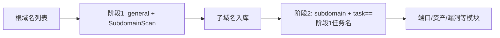

---

## name: scopesentry-mcp
description: ScopeSentry MCP を通じてセキュリティスキャンプラットフォーム（プロジェクト、タスク、テンプレート、資産、ノード）を管理します。ユーザーが ScopeSentry、MCP、API Key、スキャンタスク、資産クエリに言及した際に使用します。

# ScopeSentry MCP 利用ガイド

**ScopeSentry インスタンスを既にデプロイ済み**のユーザー向けです。Cursor（または他の MCP クライアント）からプラットフォームに接続し、ローカルのソースコードは不要です。

## 1. 準備作業

### 1.1 サービスへのアクセス確認

- デフォルトの Web インターフェース：`http://<ホスト>`
- MCP エンドポイント：`http://<ホスト>/mcp`（前段にリバースプロキシやフロントエンドプロキシがある場合は、実際の `/mcp` アドレスに従ってください）

### 1.2 API Key の作成

1. ブラウザで ScopeSentry の Web インターフェースにログインする
2. **API Key** 管理ページに進んでキーを作成する（または管理者が提供するインターフェースから作成する）
3. 返された `ssk_...` 文字列を保存する（**一度しか表示されません**）

### 1.3 Cursor MCP の設定

Cursor → Settings → MCP → サーバーを追加：

```json
{
  "mcpServers": {
    "scopesentry": {
      "url": "http://<你的主机>:8082/mcp",
      "headers": {
        "X-API-Key": "ssk_你的密钥"
      }
    }
  }
}
```

`Authorization: Bearer ssk_你的密钥` を使用することもできます。

設定が完了したら MCP を再起動するか Cursor をリロードし、ツール一覧に `list_projects`、`list_assets` などが表示されることを確認してください。

---

## 2. ツール一覧


| ツール                     | 用途                |
| ---------------------- | ----------------- |
| `list_projects`        | タグ別にグループ化されたプロジェクトツリー（プロジェクト ID を含む） |
| `list_projects_data`   | ページ分割されたプロジェクト一覧。名前で検索可能     |
| `get_project`          | プロジェクト詳細              |
| `create_project`       | プロジェクトの新規作成              |
| `list_tasks`           | スキャンタスク一覧            |
| `get_task`             | タスク詳細              |
| `list_scan_templates`  | スキャンテンプレート一覧            |
| `get_scan_template`    | テンプレート詳細              |
| `list_plugin_modules`  | スキャンパイプラインのモジュール名          |
| `list_plugins`         | 利用可能なプラグイン（hash、デフォルトパラメータを含む） |
| `create_scan_template` | スキャンテンプレートの作成            |
| `create_scan_task`     | スキャンタスクの作成            |
| `list_assets`          | 各種資産のクエリ（ページ分割された一覧）       |
| `count_assets`         | 資産数のカウント（`/api/assets/common/total`） |
| `get_asset_detail`     | 資産または脆弱性の詳細           |
| `add_asset_tag`        | 資産へのタグ追加           |
| `list_nodes`           | スキャンノード一覧            |


各ツールのパラメータは MCP ツールの説明（schema）に従ってください。`list_assets` / `count_assets` の search、filter の構文は共通であり、資産をクエリする前にまず `list_assets` の description を読むとよいでしょう。

「全部で何件あるか」を知りたい場合は `count_assets` を使用します（Web のページ分割総数インターフェースに対応）。総数を数えるために `list_assets` を繰り返しページ送りする必要はありません。

---

## 3. よく使うワークフロー

### 3.1 プロジェクト単位で資産を検索する

ユーザーまたはコンテキストに**既にプロジェクトの条件がある**場合は、まず `filter.project` を付けて範囲を絞り込み、プロジェクトをまたいでデータが多すぎることによる応答の遅延を避けてください。明確なプロジェクトがなければ、プロジェクトフィルタを無理に付ける必要はありません。

1. `list_projects` または `list_projects_data` で対象プロジェクトの **ObjectID**（`id` / `children[].value`）を取得する
2. `list_assets` に `filter.project` を渡す（**必ず ID を指定し、プロジェクトの中国語名を書いてはいけません**）

```json
{
  "asset_type": "asset",
  "pageIndex": 1,
  "pageSize": 20,
  "search": "domain=^example.com",
  "filter": {
    "project": ["<項目ObjectID>"]
  }
}
```

### 3.2 スキャンタスクの作成

1. `list_nodes` でオンラインノード名を取得する
2. `list_scan_templates` または `create_scan_template` でテンプレートの **ObjectID** を取得する
3. `create_scan_task`：`name`、`node` は必須。`template` にはテンプレート ID を指定する（テンプレート名を指定してはいけません）

**ターゲットソース `targetSource`（Web 側と同じ）：**

| targetSource | 説明 | 必須パラメータ |
| --- | --- | --- |
| `general` | ターゲットを直接入力 | `target` |
| `project` | プロジェクトからターゲットを読み込む | `project`（プロジェクト ObjectID の配列） |
| `asset` | Web 資産ライブラリから検索 | `search`；任意で `project`、`filter`、`targetNumber` |
| `RootDomain` | ルートドメインライブラリから検索 | `search`；任意で `project`、`filter`、`targetNumber` |
| `subdomain` | サブドメインライブラリから検索 | `search`；任意で `project`、`filter`、`targetNumber` |
| `UrlScan` | URL スキャン結果から検索 | `search`；任意で `project`、`filter`、`targetNumber` |
| `*Source`（例：`subdomainSource`） | 資産ページの「選択/検索」から作成 | `targetTp=search` の場合は `search` を使用；`targetTp=select` の場合は `targetIds` を使用 |

**例 — ルートドメインを直接スキャンする：**

```json
{
  "name": "example-子域名收集",
  "node": ["node-1"],
  "template": "<模板ObjectID>",
  "targetSource": "general",
  "target": "example.com\nfoo.com",
  "project": ["<項目ObjectID>"]
}
```

**例 — サブドメインライブラリから継続スキャンする（前のタスク名で絞り込み）：**

```json
{
  "name": "example-端口与漏洞",
  "node": ["node-1"],
  "template": "<后续模块模板ObjectID>",
  "targetSource": "subdomain",
  "search": "task==\"example-子域名收集\"",
  "project": ["<項目ObjectID>"]
}
```

### 3.3 ルートドメインの完全な情報収集（2 段階を推奨）

入力が**ルートドメイン**であり、かつ**完全な情報収集**を行いたい場合は、一度に全パイプラインを実行するのではなく、2 回に分けてスキャンすることを推奨します。

**理由：** 分散タスクは**単一のターゲット**を単位として分配されます。ルートドメインをターゲットとする場合、あるノードがそのルートドメインを割り当てられると、そのノード上でスキャンして得られたサブドメインも引き続き同じノードで後続モジュールが実行されるため、負荷の偏り、速度低下、エラーが発生しやすくなります。

**ベストプラクティス：**

1. **第 1 段階 — サブドメイン収集のみ**
   - `targetSource`: `general`
   - `target`: すべてのルートドメイン（複数行）
   - テンプレート：`SubdomainScan`、`SubdomainSecurity`（サブドメインスキャン + サブドメイン乗っ取り）のみを有効化
   - `get_task` でタスクの完了を待つ

2. **第 2 段階 — 後続モジュール**
   - `targetSource`: `subdomain`
   - `search`: `task=="<第一阶段任务名称>"`（タスク名の完全一致）
   - 任意で `project` を指定して範囲を絞り込む
   - テンプレート：ポートスキャン、資産マッピング、脆弱性スキャンなど（SubdomainScan を含めなくてよい）
   - サブドメインが独立したターゲットとして各ノードに分配され、並列効率がより高くなる

Web インターフェースの「サブドメイン」資産ページでタスク名で絞り込んだ後、「サブドメインからタスクを作成」を使用しても同じ効果が得られます。



### 3.4 スキャンテンプレートの作成

1. `list_plugin_modules` → モジュール名の一覧
2. `list_plugins`（`module` でフィルタ可能）→ 各プラグインの `hash` とデフォルトの `parameter`
3. `create_scan_template`：`modules` で「モジュール → プラグイン hash の配列」を指定する

---

## 4. 資産クエリ（`list_assets` / `count_assets`）

`count_assets` は `list_assets` と同じ `asset_type`、`search`、`filter` を使用し、`{ "total": N }` を返します。これは Web 側の `/api/assets/common/total` に対応します。

```json
{
  "asset_type": "subdomain",
  "search": "task==\"某任务名\"",
  "filter": {"project": ["<項目ObjectID>"]}
}
```

**パフォーマンスに関する推奨事項（`list_assets` / `count_assets` 共通）：** プロジェクトの条件がある場合はまず `filter.project` で範囲を絞り込んでください。`search` の中では、インデックスが作成済みのフィールドに対してできるだけ `==` の完全一致または `^` の前方一致を使用し（[4.3](#43-search-搜索表达式) を参照）、広範囲にわたる `=` のあいまい検索で応答が遅くなるのを避けてください。プロジェクトのコンテキストがない場合はプロジェクトフィルタを無理に付ける必要はありません。

`filter.project` をサポートする種別については [4.4](#44-filter-精确过滤) の表を参照してください。

### 4.1 資産種別 `asset_type`

`asset`、`RootDomain`、`subdomain`、`app`、`mp`、`UrlScan`、`SensitiveResult`、`DirScanResult`、`crawler`、`vulnerability`、`PageMonitoring`、`IPAsset`、`SubdomainTakerResult`

エイリアスの例：`web`→asset、`vuln`→vulnerability、`ip`→IPAsset、`url`→UrlScan

### 4.2 パラメータ説明


| パラメータ                       | 説明                                      |
| ------------------------ | --------------------------------------- |
| `pageIndex` / `pageSize` | ページ分割。デフォルトは 1 / 20                            |
| `search`                 | 検索式（次節を参照）                              |
| `filter`                 | 精密フィルタの JSON（次節を参照）                          |
| `sort`                   | UrlScan、DirScanResult のみ `length` によるソートに対応 |
| `sid`                    | SensitiveResult のみ：機密ルール名                |


`search` と `filter` は**同時に使用できます**。

### 4.3 search 検索式

独自の DSL（**SQL ではありません**）：


| 演算子  | 意味   | インデックス | 例                          |
| ---- | ---- | ---- | --------------------------- |
| `=`  | あいまい一致（regex） | インデックスを使わない | `domain=example`            |
| `==` | 完全一致（全等） | **インデックスを使う** | `port==443`                 |
| `!=` | 除外   | — | `port!="80"`                |
| `&&` | AND    | — | `domain==example.com && port==443` |
| `||` | OR    | — | `title=admin || body=login` |


**インデックスと演算子：** `domain`、`ip`、`port`、`title` などのフィールドはインデックスが作成済みですが、**`==` の完全一致**、または**値が `^` で始まる前方一致**（例：`domain=^example.com`）のみがインデックスを使えます。**`=` は regex のあいまい一致に変換され、インデックスを使えないため**、データ量が多いと遅くなりやすいです。

**すべての種別で共通の search フィールド：** `tag`、`task`（タスク名）、`rootDomain`

**project は search 内に書けません**（無効、または `&&` と組み合わせるとエラーになります）。プロジェクトで絞り込むには `filter.project` を使用してください。

**各種別でよく使う search フィールド：**


| asset_type           | フィールド                                                                                  |
| -------------------- | ----------------------------------------------------------------------------------- |
| asset                | domain, ip, port, service, app, title, statuscode, icon, banner, type, body, header |
| RootDomain           | domain, icp, company                                                                |
| subdomain            | domain, ip, type, value                                                             |
| app                  | name, icp, company, category, description, url, apk                                 |
| mp                   | name, icp, company, category, description, url                                      |
| UrlScan              | url, input, source, resultId, type                                                  |
| SensitiveResult      | url, sname, body, info, md5                                                         |
| DirScanResult        | url, statuscode, redirect, length                                                   |
| vulnerability        | url, vulname, matched, request, response, level                                     |
| crawler              | url, method, body, resultId                                                         |
| PageMonitoring       | url, hash, diff, response                                                           |
| IPAsset              | ip, domain, port, service, webServer, app                                           |
| SubdomainTakerResult | domain, value, type, response                                                       |


**search の例：**

- `domain==www.example.com && port==443`（完全一致、インデックスを使う）
- `domain=^example.com`（前方一致、インデックスを使う）
- `ip==192.168.1.1`
- `task=="某任务名"`
- `level==high`（vulnerability）
- `statuscode==200`（DirScanResult）

あいまいな部分一致が必要な場合は `=` を使います。例：`title=admin`（インデックスを使わないため、プロジェクトなどの条件と組み合わせて範囲を絞るのが望ましい）。

### 4.4 filter 精密フィルタ

JSON オブジェクト：同じ key に複数の値があると **OR**、異なる key どうしは **AND** になります。

**プロジェクトの条件がある場合はまず `project` を使用する：** ユーザーまたはコンテキストでプロジェクトが明確であり、かつ asset_type が `project` をサポートしている場合は、範囲を絞るために付けるべきです。プロジェクト情報がない場合は強制しません。


| filter key   | 意味       | 取りうる値の説明                                                     |
| ------------ | -------- | -------------------------------------------------------- |
| `project`    | 所属プロジェクト     | **ObjectID**。`list_projects` / `list_projects_data` で取得 |
| `task`       | 由来タスク     | **タスク名**。`list_tasks` の `name` を使用                         |
| `port`       | ポート       | 例：`"443"`                                                |
| `service`    | サービス/プロトコル    | 例：`"https"`                                              |
| `app`        | アプリケーションフィンガープリント     | 例：`"Nginx"`                                              |
| `icon`       | アイコン hash  |                                                          |
| `statuscode` | HTTP ステータスコード | 主に asset に使用                                               |
| `status`     | ステータス       | UrlScan/DirScan の HTTP コード；脆弱性/機密情報の処理状態                       |
| `level`      | 脆弱性レベル     | critical / high / medium / low / info                    |
| `type`       | 種類       | 例：サブドメインレコードの種別 A、CNAME                                         |
| `color`      | 機密ルールの色   | SensitiveResult                                          |
| `sname`      | 機密ルール名    | SensitiveResult                                          |
| `tags`       | タグ       |                                                          |


**各種別で使用できる filter key：**


| asset_type                            | filter key                                                      |
| ------------------------------------- | --------------------------------------------------------------- |
| asset                                 | project, port, service, app, icon, statuscode, type, task, tags |
| RootDomain                            | project, tags                                                   |
| subdomain                             | project, type, task, tags                                       |
| app / mp                              | project, tags                                                   |
| UrlScan                               | status, tags                                                    |
| DirScanResult                         | status, tags                                                    |
| SensitiveResult                       | status, color, sname, tags                                      |
| crawler                               | project, task, tags                                             |
| vulnerability                         | project, level, status, task, tags                              |
| PageMonitoring / SubdomainTakerResult | tags                                                            |
| IPAsset                               | project, port, service, app                                     |


**filter の例：**

```json
{"project": ["<項目ObjectID>"], "port": ["443"]}
```

**組み合わせクエリの例：**

```json
{
  "asset_type": "asset",
  "search": "domain=^baidu && port==443",
  "filter": {"project": ["<項目ObjectID>"]},
  "pageIndex": 1,
  "pageSize": 10
}
```

**注意：**

- プロジェクトの条件がある場合はまず `filter.project` を付ける（サポートされている場合）。プロジェクトのコンテキストがなければ強制しない
- `filter.project` にプロジェクトの表示名を書かない
- 既知の値には `==`、前方一致には `^` を使う。大きなテーブルに対して `=` のあいまい一致を乱用しない
- UrlScan の HTTP ステータスは `filter.status` を使う。DirScanResult は search 内で `statuscode==200` を使える
- SensitiveResult はルール名で：`search` で `sname=规则名` を使うか、`filter.sname` を使う

### 4.5 ソート sort

**UrlScan**、**DirScanResult** のみ対応：

```json
{"length": "ascending"}
```

その他の種別は `sort` を無視し、時刻によるデフォルトのソートになります。

---

## 5. スキャンテンプレートのモジュール名

`TargetHandler`、`SubdomainScan`、`SubdomainSecurity`、`PortScanPreparation`、`PortScan`、`PortFingerprint`、`AssetMapping`、`AssetHandle`、`URLScan`、`WebCrawler`、`URLSecurity`、`DirScan`、`VulnerabilityScan`、`PassiveScan`

---

## 6. トラブルシューティング


| 現象        | 対処                                                 |
| --------- | -------------------------------------------------- |
| MCP にツールがない   | URL、API Key、ScopeSentry が稼働しているかを確認する                    |
| 401 / 403 | API Key を再作成または交換する                                    |
| 資産が見つからない     | `filter.project` が ObjectID であることを確認する。search に project を書かない |
| テンプレート/タスクの作成に失敗 | `template` はテンプレートの ObjectID でなければならない。`node` にはオンラインノード名を指定する            |
| クエリが非常に遅い/固まる   | プロジェクトがある場合は `filter.project` を付ける。search ではインデックス済みフィールドに `==` または `^` 前方一致を使い、`=` を控える。`pageSize` を小さくする |


---
